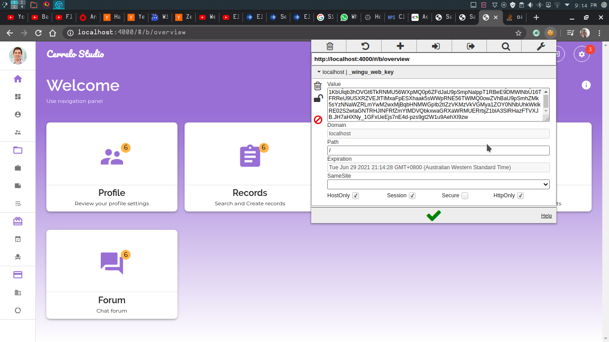
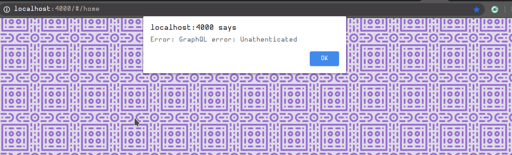
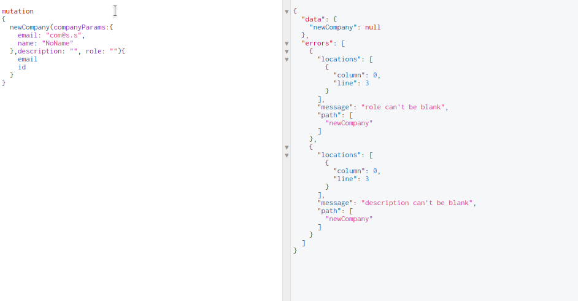

# Wingu System


Wingu is a fullstack application written in Using
[Phoenix](http://phoenixframework.org) and [VueJS](http://vuejs.org). The
phoenix backend exposes a [GraphQL](http://graphql.org) API which links to the
UI using [Vue-Apollo](https://github.com/vuejs/vue-apollo). The site is supposed
to reflect typical website operations but are really there to show a fraction
of the functionality one can achieve with Elixir.

Functionally the various operations are:

## Backend:

  1. *OAuth* workflow with [Guardian](https://github.com/ueberauth/guardian) and
     UeberAuth, particularly the [Google Strategy](https://github.com/ueberauth/ueberauth_google)
  2. Database Handling with [Ecto.Multi](https://github.com/elixir-ecto/ecto)
  3. *GraphQL* Document server with [Absinthe](https://github.com/absinthe-graphql/absinthe)
  4. SAML token handling (Under Construction)

### OAuth with Guardian and UeberAuth

OAuth according to (OAuth Website)[oauth.net/2/] is:

>   "..Industry-standard protocol for authorization.  *OAuth 2.0* focuses on
>  client developer simplicity while  providing specific authorization flows
>  for  web applications,  desktop applications,  mobile phones,  and living
>  room devices.."

UeberAuth   is   an  implementation   of   the   OAuth  Authentication   API
which   empowers    developers   to    use   _Strategies_    as   "*Plugs*".
[Plug](https://github.com/elixir-plug/plug)  allowing for  *Composable modules*
which  are incredibly  _verstile_ in  a Phoenix  application. The  UeberAuth
strategy  used here  is google  which requires  one to  write callbacks  and
functionality for  handling the  sign in  using Google  as the  provider, an
example callback is:

```elixir
# Author: Harry Kituyi

defmodule WinguWeb.GoogleAuthController do
  use WinguWeb, :controller
  plug Ueberauth

  # File: (./apps/wingu_web/lib/wingu_web/auth/google_auth_controller.ex)
  # Setup aliases

  def callback(
        %Plug.Conn{
          assigns: %{
            ueberauth_auth: %Ueberauth.Auth{credentials: creds, info: client_info, extra: extra}
          }
        } = conn,
        _params
      ) do
    client_params = %{
      firstname: client_info.first_name,
      surname: client_info.last_name,
      picture: client_info.image,
      email: client_info.email,
      email_verified: extra.raw_info.user["email_verified"]
    }

    case Repo.get_by(Client, email: client_info.email) do
      nil ->
        changeset = Client.changeset(%Client{}, client_params)
        ...

      %Client{} = oldclient ->
        ...
    end
  end

  def callback(conn, _params) do
    ...
  end

end
```

Elixirs' pattern matching proves useful in this Context and its clear to see
what would happen  in case out OAuth didn't work.  Guardian sign_in create a
signed token in the `conn` struct using the client identification.



### Database Handling with Ecto

Ecto is the most widely library for database connections. Here the `Ecto.Multi`
is used to group multiple operations and even run arbitrary functions. Here's
a snippet.

```elixir
defmodule WinguWeb.GraphQL.Resolvers.FormResolver do
  @moduledoc ~S"""
  #######################################################################
  #                            FormResolver                             #
  #######################################################################

  @author: Harry Kituyi
  @mail: kituyiharry@gmail.com

  A GraphQL Resolver for Forms
  """
  alias Wingu.{
    Companies,
    DocumentClasses,
    Repo,
    Forms,
    FormTemplates,
    SectionNodes,
    DescriptionNodes,
    Clients,
    TextNodeData
  }

  alias WinguWeb.GraphQL.TransactionHelper
  alias Ecto.Multi

  import Ecto.Query
  require IO

  ...

  @doc "Creates a form with associated template for a company"
  def create_form(
        _parent,
        %{company: company, docclass: class, form: %{name: n, summary: s, description: d, template: t}},
        %{context: %{"sub" => _id}}
      ) do
    ## Substitute to Multi format, easy to handle
    mul =
      Multi.new()
      |> Multi.run(:get_company, fn repo, _change ->
        TransactionHelper.handle_fetch(repo, Companies.Company, company)
      end)
      |> Multi.run(:get_doc_class, fn repo, _change ->
        TransactionHelper.handle_fetch(repo, DocumentClasses.DocumentClass, class)
      end)
      |> Multi.insert(:form, fn %{get_company: company, get_doc_class: document_class} ->
        # Associate the form and Convert into a Form Changeset
        Ecto.build_assoc(company, :forms)
        |> Forms.Form.changeset(%{name: n, summary: s, description: d, document_class_id: class})
        |> Ecto.Changeset.put_assoc(:document_class, document_class)
      end)
      |> Multi.insert(:template, fn %{form: form} ->
        # Associate the FormTemplate and Convert into a FormTemplate Changeset
        Ecto.build_assoc(form, :form_templates) |> FormTemplates.FormTemplate.changeset(%{})
      end)
      |> Multi.merge(fn %{template: template} ->
        # Delegate to handler Function
        Enum.with_index(t.sections)
        |> Enum.reduce(Multi.new(), fn {entry, index}, multi ->
          key = "sections_#{index}"
          nodes = entry.nodes

          Multi.insert(multi, key, fn _empty ->
            Ecto.build_assoc(template, :sections_nodes)
            |> SectionNodes.SectionNode.changeset(entry)
          end)
          # Capture each new section and Merge this transaction
          |> Multi.merge(fn %{^key => section} ->
            dkey = "nodes_#{key}"

            nodes
            |> Enum.with_index()
            |> Enum.reduce(Multi.new(), fn {subnode, index}, multi ->
              key = "insert_#{dkey}_#{index}"

              Multi.insert(multi, key, fn _changes ->
                Ecto.build_assoc(section, :description_nodes)
                |> DescriptionNodes.DescriptionNode.changeset(subnode)
              end)
            end)
          end)
        end)
      end)

    TransactionHelper.handle_transaction(mul, :form)
  end

  ...
end
```

A Multi is  piped through various operations describing  if any intermediate
operations(insert, update ...) need to be carried out in the transaction and
finally the Multi is passed to a transaction handler module.

The great thing about this is:
  1. If a section fails. The execution stops immediately
  2. We don't perform multiple transactions for complex operations

### GraphQL with Absinthe

According to [graphql.org](graphql.org) : 

> "GraphQL is  a  query language  for  APIs and  a  runtime for  fulfilling
> those  queries with  your existing  data.  GraphQL provides  a complete  and
> understandable description of the data in  your API, gives clients the power
> to ask  for exactly  what they  need and  nothing more,  makes it  easier to
> evolve APIs over time, and enables powerful developer tools."

The absinthe family of libraries allow for creation of GraphQL Endpoints that
are also Composable similar to UeberAuth. It uses plug under the hood making it
just as Composable without tightly coupling it to Phoenix.

GraphQL endpoints have to be secure too but Absinthe allows the developer to
define a plug that runs early in the pipeline to create an "**Authenticated
Context**" for signed in users. This function returns a tuple of {:error, _ },
when the user is unauthenticated preventing the pipeline from proceeding

```elixir
  ...
  @doc "Return resolution when context is authenticated"
  def handle_auth(%{context: %{"sub" => _sub}} = resolution, _config) do
    resolution
  end

  @doc "Return error if not auth"
  def handle_auth(resolution, _config) do
    resolution |> Absinthe.Resolution.put_result({:error, "Unathenticated"})
  end
 ...
 ...
 ...

  query do
    @desc "Information about the current client"
    field :client, :client do
      middleware(:handle_auth)          # Authenticated middleware check
      resolve(&Resolvers.ClientResolver.client/3)
    end
  ...

```

Therefore Unathenticated requests raise Errors



Documents that don't properly resolve are also shown as errors to the developer.
Here it is in an Interactive window.




## Frontend

  1. Material Design system using [Vuetify](https://vuetifyjs.com/) 
  2. Apollo GraphQL Client using [Vue-Apollo](https://github.com/vuejs/vue-apollo)
  3. SPA Routing with [Vue-Router](https://router.vuejs.org/)
  4. Redux-like State management using [VueX](https://vuex.vuejs.org/)
  5. Some light animations with AoS
